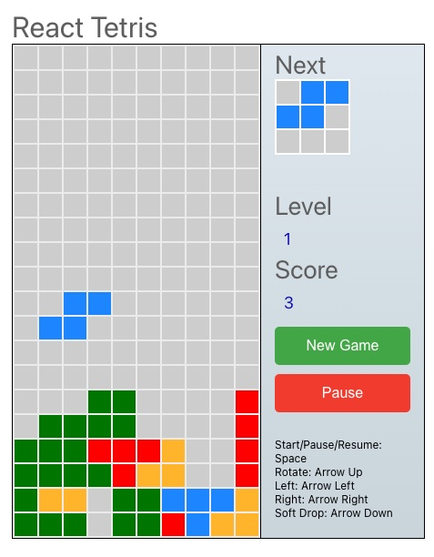

# 🎮 React Tetris V1

Classic Tetris game built with React.js - Initial Version

[](https://reactjs.org/)
[](https://nodejs.org/)
[](https://www.docker.com/)



---

## 📖 About

This is the **initial version** of the Tetris game used in the DevSecOps Kubernetes project. It's a fully functional React-based Tetris game that demonstrates:

- Classic Tetris gameplay mechanics
- React component architecture
- Responsive design
- Docker containerization for CI/CD pipelines

---

## 🚀 Quick Start

### Prerequisites

- Node.js (v16 or higher)
- npm or yarn

### Installation

1. **Navigate to the project directory:**
   ```bash
   cd Tetris-V1
   ```

2. **Install dependencies:**
   ```bash
   npm install
   ```

3. **Start the development server:**
   ```bash
   npm start
   ```

4. **Open your browser:**
   Navigate to `http://localhost:3000`

---

## 📦 Available Scripts

| Command | Description |
|---------|-------------|
| `npm start` | Runs the app in development mode |
| `npm run build` | Builds the app for production |
| `npm test` | Runs tests in interactive watch mode |
| `npm run eject` | Ejects from Create React App (one-way operation) |

---

## 🐳 Docker Support

This application is containerized for seamless CI/CD integration.

### Build Docker Image

```bash
docker build -t tetrisv1 .
```

### Run Docker Container

```bash
docker run -p 3000:3000 tetrisv1
```

### Dockerfile Overview

The Dockerfile uses a multi-stage approach:
- Base image: `node:16`
- Working directory: `/app`
- Exposed port: `3000`
- Build process: `npm run build`
- Start command: `npm start`

---

## 🏗️ Project Structure

```
Tetris-V1/
├── public/              # Static files and HTML template
│   ├── index.html      # Main HTML file
│   └── ...             # Other static assets
├── src/                 # React source code
│   ├── components/     # React components
│   ├── styles/         # CSS stylesheets
│   ├── App.js          # Main application component
│   ├── index.js        # Application entry point
│   └── ...             # Other source files
├── images/              # Game images and assets
│   └── game.jpg        # Game screenshot
├── Dockerfile           # Docker configuration
├── package.json         # Project dependencies and scripts
└── README.md            # This file
```

---

## 🎮 Game Controls

| Key | Action |
|-----|--------|
| ← | Move left |
| → | Move right |
| ↑ | Rotate piece |
| ↓ | Soft drop |
| Space | Hard drop |
| P | Pause game |

---

## 🔧 Dependencies

### Core Dependencies
- React: 17.0.2
- React DOM: 17.0.2
- React Scripts: 4.0.3

### Testing Dependencies
- @testing-library/react: 11.2.6
- @testing-library/jest-dom: 5.1.10
- @testing-library/user-event: 12.8.3

### Development Dependencies
- css-loader: 4.3.0

---

## 🔒 Security in CI/CD

This application is integrated into a DevSecOps pipeline with:

- **SonarQube**: Code quality and security analysis
- **OWASP Dependency-Check**: Vulnerability scanning for dependencies
- **Trivy**: Container and file system vulnerability scanning

---

## 🌐 Deployment

This application is deployed on AWS EKS using Kubernetes manifests located in the [`Manifest-file`](../Manifest-file/) directory.

### Kubernetes Resources

- **Deployment**: 3 replicas for high availability
- **Service**: LoadBalancer type for external access
- **Port**: 80 (external) → 3000 (container)

---

## 🤝 Contributing

This is part of a larger DevSecOps learning project. For the main project repository, visit:
[End-to-End DevSecOps Kubernetes Project](../README.md)

---

## 📄 License

This project is part of the main repository licensed under Apache License 2.0.
See the [LICENSE](../LICENSE) file in the root directory for details.

---

## 🔗 Links

- [Main Project README](../README.md)
- [Tetris V2 Documentation](../Tetris-V2/README.md)
- [DevSecOps Blog Post](https://amanpathakdevops.medium.com/devsecops-mastery-a-step-by-step-guide-to-deploying-tetris-on-aws-eks-with-jenkins-and-argocd-3adcf21b3120)

---

**Enjoy playing Tetris! 🎮**
