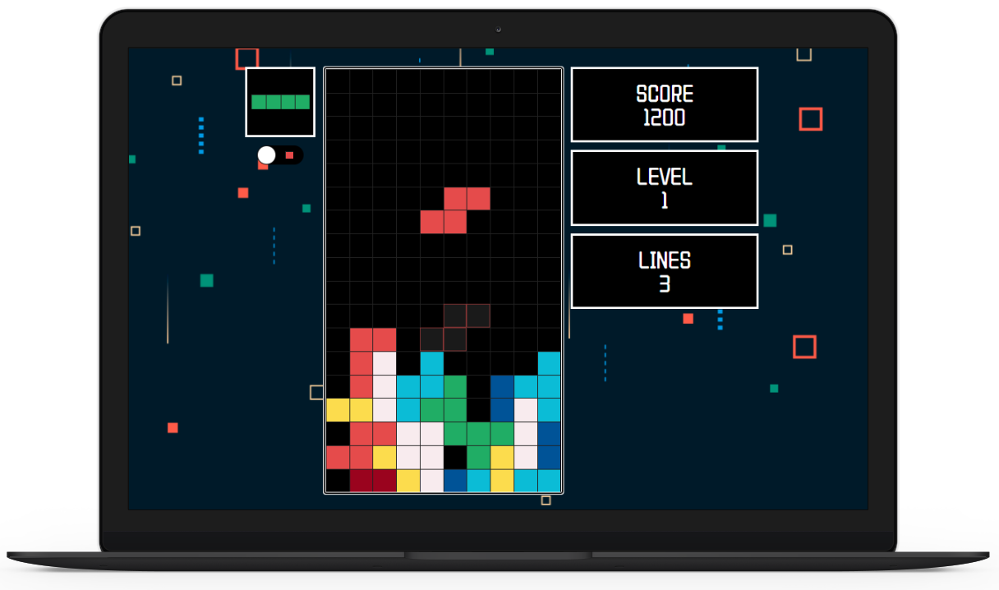
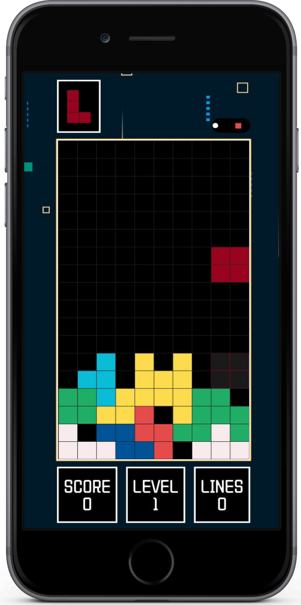
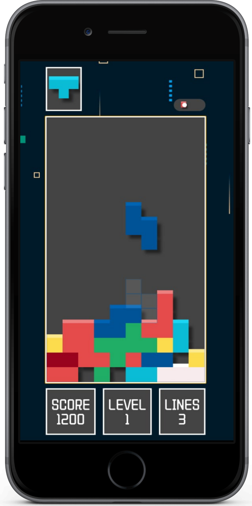

# 🎮 React Tetris V2

> Fully responsive Tetris game built with ReactJS - Enhanced Version

[](https://reactjs.org/)
[](https://nodejs.org/)
[](https://www.docker.com/)
[](https://mpirescarvalho.github.io/react-tetris/)
[](https://github.com/mpirescarvalho/react-tetris)

## 📸 Screenshots






---

## 📖 About

This is the **enhanced version** of the Tetris game used in the DevSecOps Kubernetes project. V2 includes improved features such as:

- ✨ **Fully Responsive Design** - Works seamlessly on desktop and mobile devices
- 🎨 **Enhanced UI/UX** - Modern styling with styled-components
- 📱 **Touch Support** - Mobile gesture controls
- 🎮 **Advanced Features** - Theme toggle, animations, and more
- 🔄 **Spring Animations** - Smooth transitions with react-spring

---

## 🚀 Quick Start

### Prerequisites

- Node.js (v16 or higher)
- npm or yarn

### Installation

1. **Navigate to the project directory:**
   ```bash
   cd Tetris-V2
   ```

2. **Install dependencies:**
   ```bash
   npm install
   ```

3. **Start the development server:**
   ```bash
   npm start
   ```

4. **Open your browser:**
   Navigate to `http://localhost:3000`

---

## 📦 Available Scripts

| Command | Description |
|---------|-------------|
| `npm start` | Runs the app in development mode |
| `npm run build` | Builds the app for production |
| `npm test` | Runs tests in interactive watch mode |
| `npm run eject` | Ejects from Create React App (one-way operation) |
| `npm run deploy` | Deploys to GitHub Pages |
| `npm run predeploy` | Pre-deployment build script |

---

## 🐳 Docker Support

This application is containerized for seamless CI/CD integration.

### Build Docker Image

```bash
docker build -t tetrisv2 .
```

### Run Docker Container

```bash
docker run -p 3000:3000 tetrisv2
```

### Dockerfile Overview

The Dockerfile uses a multi-stage approach:
- Base image: `node:16`
- Working directory: `/app`
- Exposed port: `3000`
- Build process: `npm run build`
- Start command: `npm start`

---

## 🏗️ Project Structure

```
Tetris-V2/
├── .github/             # GitHub workflows and configurations
├── assets/              # Images and visual assets
│   ├── react-tetris-desktop-1.png
│   ├── react-tetris-mobile-1.png
│   └── react-tetris-mobile-2.png
├── public/              # Static files and HTML template
│   ├── index.html      # Main HTML file
│   └── ...             # Other static assets
├── src/                 # React source code
│   ├── components/     # React components
│   ├── styles/         # Styled-components and CSS
│   ├── hooks/          # Custom React hooks
│   ├── utils/          # Utility functions
│   ├── App.js          # Main application component
│   ├── index.js        # Application entry point
│   └── ...             # Other source files
├── .gitignore           # Git ignore rules
├── Dockerfile           # Docker configuration
├── package.json         # Project dependencies and scripts
└── README.md            # This file
```

---

## 🎮 Game Controls

### Desktop

| Key | Action |
|-----|--------|
| ← | Move left |
| → | Move right |
| ↑ | Rotate piece |
| ↓ | Soft drop |
| Space | Hard drop |
| P | Pause game |

### Mobile

| Gesture | Action |
|---------|--------|
| Swipe Left | Move left |
| Swipe Right | Move right |
| Swipe Up | Rotate piece |
| Swipe Down | Soft drop |
| Tap | Hard drop |

---

## 🎨 Features

- **Responsive Design**: Adapts to all screen sizes
- **Touch Controls**: Mobile-friendly gesture support
- **Theme Toggle**: Switch between light and dark themes
- **Animations**: Smooth spring-based animations
- **Loading States**: Engaging loading spinners
- **Score Tracking**: Real-time score updates
- **Level System**: Progressive difficulty
- **Next Piece Preview**: See upcoming tetrominoes

---

## 🔧 Dependencies

### Core Dependencies
| Package | Version | Description |
|---------|---------|-------------|
| react | 16.12.0 | React core library |
| react-dom | 16.12.0 | React DOM renderer |
| react-scripts | 3.4.0 | Create React App scripts |
| styled-components | 5.0.1 | CSS-in-JS styling |
| react-spring | 8.0.27 | Spring-physics animations |
| react-responsive | 8.0.3 | Media query matching |
| react-use-gesture | 7.0.5 | Touch gesture handling |
| react-spinners | 0.8.1 | Loading spinners |
| react-switch | 5.0.1 | Toggle switch component |
| react-toggle | 4.1.1 | Toggle component |
| arrow-keys-react | 1.0.6 | Arrow key handling |
| color | 3.1.2 | Color manipulation |

### Dev Dependencies
| Package | Version | Description |
|---------|---------|-------------|
| gh-pages | 2.2.0 | GitHub Pages deployment |
| typescript | 3.3.3 | TypeScript support |

---

## 🔒 Security in CI/CD

This application is integrated into a DevSecOps pipeline with:

- **SonarQube**: Code quality and security analysis
- **OWASP Dependency-Check**: Vulnerability scanning for dependencies
- **Trivy**: Container and file system vulnerability scanning

### Pipeline Stages

1. Code Checkout
2. SonarQube Analysis
3. Quality Gate Check
4. Dependency Installation
5. OWASP Dependency-Check Scan
6. Trivy File Scan
7. Docker Build
8. Docker Push to Registry
9. Trivy Image Scan
10. Kubernetes Manifest Update

---

## 🌐 Deployment

This application is deployed on AWS EKS using Kubernetes manifests located in the [`Manifest-file`](../Manifest-file/) directory.

### Kubernetes Resources

- **Deployment**: 3 replicas for high availability
- **Service**: LoadBalancer type for external access
- **Port**: 80 (external) → 3000 (container)
- **Image**: `avian19/tetrisv1:<BUILD_NUMBER>`

### Deploy to GitHub Pages

```bash
npm run deploy
```

---

## 🆚 V1 vs V2 Comparison

| Feature | V1 | V2 |
|---------|----|----|
| Responsive Design | ❌ | ✅ |
| Mobile Support | ❌ | ✅ |
| Touch Controls | ❌ | ✅ |
| Theme Toggle | ❌ | ✅ |
| Animations | Basic | Advanced (react-spring) |
| Styled Components | ❌ | ✅ |
| GitHub Pages Deploy | ❌ | ✅ |

---

## 🤝 Contributing

This is part of a larger DevSecOps learning project. For the main project repository, visit:
[End-to-End DevSecOps Kubernetes Project](../README.md)

### Original Project

This Tetris implementation is based on the work by [mpirescarvalho](https://github.com/mpirescarvalho/react-tetris).

---

## 📄 License

This project is part of the main repository licensed under Apache License 2.0.
See the [LICENSE](../LICENSE) file in the root directory for details.

---

## 🔗 Links

- [Main Project README](../README.md)
- [Tetris V1 Documentation](../Tetris-V1/README.md)
- [Original Tetris Project](https://github.com/mpirescarvalho/react-tetris)
- [Live Demo](https://mpirescarvalho.github.io/react-tetris/)
- [DevSecOps Blog Post](https://amanpathakdevops.medium.com/devsecops-mastery-a-step-by-step-guide-to-deploying-tetris-on-aws-eks-with-jenkins-and-argocd-3adcf21b3120)

---

**Enjoy playing Tetris! 🎮**
